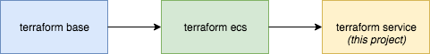

# Setting up an AWS ECS service (ClamAV) using Terraform

The following project deploys an ECS service to AWS. This example uses installs a [clamav](https://www.clamav.net/) [container](https://hub.docker.com/r/dinkel/clamavd/), however any docker container can be substituted.

This assumes that you have a running ECS cluster in AWS. If you are continuing on from the previous [project](https://github.com/CERATechnologies/terraform-ecs) we are in the third part of the series.

### Overall series Architecture



# Setting up

### Helper script

Within the project I have written a helper script called `run.sh`, it is very simple but will ensure that you always use the correct workspace with the accompanying variables file. It can be use like this:

It also uses an AWS profile matching the workspace name.

```sh
./run.sh plan prod
```

The above example will run a terraform plan on the prod workspace. It looks in the `workspace-variables` directory for a variable file called `prod.tfvars`, the same name as we used for the workspace.

The `run.sh` is very basic and currently does not support extra parameters. Basic useage of terraform `plan`, `apply` and destroy work fine.

If you don't want to use the run script, you can see the command that we use to run terraform in the script itself.

# Configuration

As mentioned above, we provide and override variables with a file matching the name of our workspace in the `workspace-variables` directory. An example would look like this:

```
zone_name = "oculo"
ecs_cluster_name = "services"
iam_role = "ecs-role"

ecs_cluster_id = "arn:aws:ecs:ap-southeast-2:ID:cluster/yourservices"
vpc_id = "vpc-example"
availability_zones = "ap-southeast-2a,ap-southeast-2b,ap-southeast-2c"
subnet_ids = "subnet-example1,subnet-example2,subnet-example3"
cidr_blocks = "172.31.0.0/16"
```

# Deploying our infrastructure

```sh
./run.sh plan yourworkspacename
```

If this all works as expected with no errors you can then apply the changes.

```
./run.sh apply yourworkspacename
```

You should see something like the following:

```sh
Apply complete! Resources: x added, 0 changed, 0 destroyed.
```


